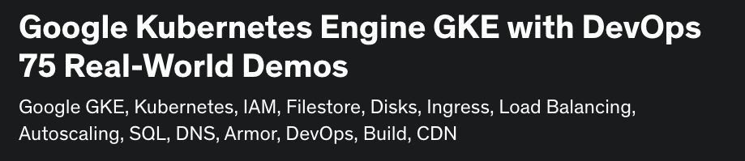

# [Google Kubernetes Engine GKE with DevOps 75 Real-World Demos](https://links.stacksimplify.com/gcp-google-kubernetes-engine-gke-with-devops)


---
title: GCP Google Kubernetes Engine GKE CI
description: Implement GCP Google Kubernetes Engine GKE Continuous Integration
---

## Step-00: Pre-requisites
1. Verify if GKE Cluster is created
2. Verify if kubeconfig for kubectl is configured in your local terminal
```t
# Configure kubeconfig for kubectl
gcloud container clusters get-credentials <CLUSTER-NAME> --region <REGION> --project <PROJECT>

# Replace Values CLUSTER-NAME, REGION, PROJECT
gcloud container clusters get-credentials standard-cluster-private-1 --region us-central1 --project kdaida123

# List Kubernetes Nodes
kubectl get nodes
```


## Step-01: Introduction
- Implement Continuous Integration for GKE Workloads using
- Google Cloud Source
- Google Cloud Build
- Google Artifact Repository


## Step-02: Enable APIs in Google Cloud
```t
# Enable APIs in Google Cloud
gcloud services enable container.googleapis.com \
    cloudbuild.googleapis.com \
    sourcerepo.googleapis.com \
    artifactregistry.googleapis.com

# Google Cloud Services 
GKE: container.googleapis.com     
Cloud Build: cloudbuild.googleapis.com
Cloud Source: sourcerepo.googleapis.com
Artifact Registry: artifactregistry.googleapis.com
```

## Step-03: Create Artifact Repository
```t
# List Artifact Repositories
gcloud artifacts repositories list

# Create Artifact Repository
gcloud artifacts repositories create myapps-repository \
  --repository-format=docker \
  --location=us-central1 

# List Artifact Repositories
gcloud artifacts repositories list

# Describe Artifact Repository 
gcloud artifacts repositories describe myapps-repository --location=us-central1
```

## Step-04: Install Git client on local desktop (if not present)
```t
# Download and Install Git Client and Installed
https://git-scm.com/downloads
```

## Step-05: Create SSH Keys for Git Repo Access
- [Generating SSH Key Pair](https://cloud.google.com/source-repositories/docs/authentication#generate_a_key_pair)
```t
# Change Directory
cd 01-SSH-Keys

# Create SSH Keys
ssh-keygen -t [KEY_TYPE] -C "[USER_EMAIL]"
KEY_TYPE: rsa, ecdsa, ed25519
USER_EMAIL: dkalyanreddy@gmail.com 

# Replace Values KEY_TYPE, USER_EMAIL
ssh-keygen -t ed25519 -C "dkalyanreddy@gmail.com"
Provide the File Name as "id_gcp_cloud_source"

## Sample Output
Kalyans-Mac-mini:01-SSH-Keys kalyanreddy$ ssh-keygen -t ed25519 -C "dkalyanreddy@gmail.com"
Generating public/private ed25519 key pair.
Enter file in which to save the key (/Users/kalyanreddy/.ssh/id_ed25519): id_gcp_cloud_source
Enter passphrase (empty for no passphrase): 
Enter same passphrase again: 
Your identification has been saved in id_gcp_cloud_source
Your public key has been saved in id_gcp_cloud_source.pub
The key fingerprint is:
SHA256:YialyCj3XaSa4b8ewk4bcK1hXxO7DDM5uiCP1J2TOZ0 dkalyanreddy@gmail.com
The key's randomart image is:
+--[ED25519 256]--+
|                 |
|                 |
|      . o        |
| o . + + o       |
|o = B % S        |
|...B.&=X.o       |
|....%B+Eo        |
|.+ + *o.         |
|. . +.+.         |
+----[SHA256]-----+
Kalyans-Mac-mini:01-SSH-Keys kalyanreddy$ ls -lrta
total 16
drwxr-xr-x  6 kalyanreddy  staff  192 Jun 29 09:45 ..
-rw-------  1 kalyanreddy  staff  419 Jun 29 09:46 id_gcp_cloud_source
drwxr-xr-x  4 kalyanreddy  staff  128 Jun 29 09:46 .
-rw-r--r--  1 kalyanreddy  staff  104 Jun 29 09:46 id_gcp_cloud_source.pub
Kalyans-Mac-mini:01-SSH-Keys kalyanreddy$ 
```

## Step-06: Review SSH Keys (Public and Private Keys)
```t
# Change Directroy 
cd 01-SSH-Keys

# Review Private Key: id_gcp_cloud_source
cat id_gcp_cloud_source

# Review Public Key: id_gcp_cloud_source.pub 
cat id_gcp_cloud_source.pub 
```

## Step-07: Update SSH Public Key in Google Cloud Source
- Go to -> Source Repositories -> 3 Dots -> Manage SSH Keys -> Register SSH Key
- [Google Cloud Source URL](https://source.cloud.google.com/)
```t
# Key Name
Name: gke-course
Key: Output from command "cat id_gcp_cloud_source.pub" in previous step. Put content from Public Key
```
- Click on **Register**


## Step-08: Update SSH Private Key in Git Config
- Update SSH Private Key in your local desktop Git Config
```t
# Copy SSH Private Key to your ".ssh" folder in your Home Directory from your course
cd 01-SSH-Keys
cp id_gcp_cloud_source $HOME/.ssh  

# Change Directory (Your local desktop home directory)
cd $HOME/.ssh  

# Verify File in "$HOME/.ssh"
ls -lrta id_gcp_cloud_source

# Verify existing git "config" file
cat config

# Backup any existing "config" file
cp config config_bkup_before_cloud_source

# Update "config" file to point to "id_gcp_cloud_source" private key
vi config

## Sample Output after changes
Kalyans-Mac-mini:.ssh kalyanreddy$ cat config
Host *
  AddKeysToAgent yes
  UseKeychain yes
  IdentityFile ~/.ssh/id_gcp_cloud_source
Kalyans-Mac-mini:.ssh kalyanreddy$ 

# Backup config with cloudsource
cp config config_with_cloud_source_key
```

## Step-09: Update Git Global Config in your local deskopt
```t
# List Global Git Config
git config --list

# Update Global Git Config
git config --global user.email "YOUR_EMAIL_ADDRESS"
git config --global user.name "YOUR_NAME"

# Replace YOUR_EMAIL_ADDRESS, YOUR_NAME
git config --global user.name "Kalyan Reddy Daida"
git config --global user.email "dkalyanreddy@gmail.com"

# List Global Git Config
git config --list
```

## Step-10: Create Git repositories in Cloud Source
```t
# List Cloud Source Repository
gcloud source repos list

# Create Git repositories in Cloud Source
gcloud source repos create myapp1-app-repo

# List Cloud Source Repository
gcloud source repos list

# Verify using Cloud Console
Search for -> Source Repositories 
https://source.cloud.google.com/repos
```

## Step-11: Clone Cloud Source Git Repository, Commit a Change, Push to Remote Repo and Verify
```t
# Change Directory 
cd course-repos

# Verify using Cloud Console
Search for -> Source Repositories 
https://source.cloud.google.com/repos
Go to Repo -> myapp1-app-repo -> SSH Authentication

# Copy the git clone command and run 
git clone ssh://dkalyanreddy@gmail.com@source.developers.google.com:2022/p/kdaida123/r/myapp1-app-repo

# Change Directory
cd myapp1-app-repo

# Create a simple readme file
touch README.md
echo "# GKE CI Demo" > README.md
ls -lrta

# Add Files and do local commit
git add .
git commit -am "First Commit"

# Push file to Cloud Source Git Repo (Remote Repo)
git push

# Verify in Git Remote Repo
Search for -> Source Repositories 
https://source.cloud.google.com/repos
Go to Repo -> myapp1-app-repo 
```

## Step-12: Review Files in 02-Docker-Image folder
1. Dockerfile
2. index.html

## Step-13: Copy files from 02-Docker-Image folder to Git Repo
```t
# Change Directroy 
cd 57-GKE-Continuous-Integration/02-Docker-Image

# Copy Files to Git repo "myapp1-app-repo"
1. Dockerfile
2. index.html

# Local Git Commit and Push to Remote Repo
git add .
git commit -am "Second Commit"
git push

# Verify in Git Remote Repo
Search for -> Source Repositories 
https://source.cloud.google.com/repos
Go to Repo -> myapp1-app-repo 
```

## Step-14: Create a container image with Cloud Build and store it in Artifact Registry using glcoud builds command
```t
# Change Directory (Git App Repo: myapp1-app-repo)
cd myapp1-app-repo

# Get latest git commit id (current branch)
git rev-parse HEAD

# Get latest git commit id first 7 chars (current branch)
git rev-parse --short=7 HEAD

# Ensure you are in local git repo folder where "Dockerfile, index.html" present
cd myapp1-app-repo 

# Create a Cloud Build build based on the latest commit 
gcloud builds submit --tag="us-central1-docker.pkg.dev/${PROJECT_ID}/${$APP_ARTIFACT_REPO}/myapp1:${COMMIT_ID}" .

# Replace Values ${PROJECT_ID}, ${$APP_ARTIFACT_REPO}, ${COMMIT_ID}
gcloud builds submit --tag="us-central1-docker.pkg.dev/kdaida123/myapps-repository/myapp1:6f7d338" .
```

## Step-15: Review Cloud Build YAML file
```yaml
steps:
# This step builds the container image.
- name: 'gcr.io/cloud-builders/docker'
  id: Build
  args:
  - 'build'
  - '-t'
  - 'us-central1-docker.pkg.dev/$PROJECT_ID/myapps-repository/myapp1:$SHORT_SHA'
  - '.'

# This step pushes the image to Artifact Registry
# The PROJECT_ID and SHORT_SHA variables are automatically
# replaced by Cloud Build.
- name: 'gcr.io/cloud-builders/docker'
  id: Push
  args:
  - 'push'
  - 'us-central1-docker.pkg.dev/$PROJECT_ID/myapps-repository/myapp1:$SHORT_SHA'
```

## Step-16: Copy cloudbuild.yaml to Git Repo
```t
# Change Directroy 
cd 57-GKE-Continuous-Integration/03-cloudbuild-yaml

# Copy Files to Git repo
1. cloudbuild.yaml

# Local Git Commit and Push to Remote Repo
git add .
git commit -am "Third Commit"
git push

# Verify in Git Remote Repo
Search for -> Source Repositories 
https://source.cloud.google.com/repos
Go to Repo -> myapp1-app-repo 
```

## Step-17: Create Continuous Integration Pipeline in Cloud Build
- Go to Cloud Build -> Dashboard -> Region: us-central-1 -> Click on **SET UP BUILD TRIGGERS** [OR]
- Go to Cloud Build -> TRIGGERS -> Click on **CREATE TRIGGER** 
- **Name:** myapp1-ci
- **Region:** us-central1
- **Description:** myapp1 Continuous Integration Pipeline
- **Tags:** environment=dev
- **Event:** Push to a branch
- **Source:** myapp1-app-repo
- **Branch:** main (Auto-populated)
- **Configuration:** Cloud Build configuration file (yaml or json)
- **Location:** Repository
- **Cloud Build Configuration file location:** /cloudbuild.yaml
- **Approval:** leave unchecked
- **Service account:** leave to default
- Click on **CREATE**


## Step-18: Make a simple change in "index.html" and push the changes to Git Repo
```t
# Change Directroy 
cd myapp1-app-repo

# Update file index.html (change V1 to V2)
<p>Application Version: V2</p>

# Local Git Commit and Push to Remote Repo
git status
git add .
git commit -am "V2 Commit"
git push

# Verify in Git Remote Repo
Search for -> Source Repositories 
https://source.cloud.google.com/repos
Go to Repo -> myapp1-app-repo 
```

## Step-19: Verify Code Build CI Pipeline
```t
# Verify Code Build
1. Go to Code Build -> Dashboard or go directly to Code Build -> History
2. Click on Build History -> View All
3. Verify "BUILD LOG"
4. Verify "EXECUTION DETAILS"
5. Verify "VIEW RAW"

# Verify Artifact Repository
1. Go to Artifact Registry -> myapps-repository -> myapp1
2. You should find the docker image pushed to Artifact Registry
```

## Step-20: Review Kubernetes Manifests
- **Project Folder:** 04-kube-manifests
- 01-kubernetes-deployment.yaml
- 02-kubernetes-loadBalancer-service.yaml

## Step-21: Update Container Image to V1 Docker Image we built
```yaml
# 01-kubernetes-deployment.yaml: Update "image" 
    spec:
      containers: # List
        - name: myapp1-container
          image: us-central1-docker.pkg.dev/kdaida123/myapps-repository/myapp1:d1c3b88
          ports: 
            - containerPort: 80  
```

## Step-22: Deploy Kubernetes Manifests and Verify
```t
# Change Directory
You should in Course Content folder 
google-kubernetes-engine/<RESPECTIVE-SECTION>

# Deploy Kubernetes Manifests
kubectl apply -f 04-kube-manifests

# List Deployments
kubectl get deploy

# List Pods
kubectl get pods

# Describe Pod (Review Events to understand from where Docker Image downloaded)
kubectl describe pod <POD-NAME>

# List Services
kubectl get svc

# Access Application
http://<EXTERNAL-IP-GET-SERVICE-OUTPUT>
Observation:
1. You should see "Application Version: V1"
```

## Step-23: Update Container Image to V2 Docker Image we built
```yaml
# 01-kubernetes-deployment.yaml: Update "image" 
    spec:
      containers: # List
        - name: myapp1-container
          image: us-central1-docker.pkg.dev/kdaida123/myapps-repository/myapp1:3af592c
          ports: 
            - containerPort: 80  
```

## Step-24: Update Kubernetes Deployment and Verify
```t
# Deply Kubernetes Manifests (Updated Image Tag)
kubectl apply -f 04-kube-manifests

# Restart Kubernetes Deployment (Optional - if it is not updated)
kubectl rollout restart deployment myapp1-deployment

# List Deployments
kubectl get deploy

# List Pods
kubectl get pods

# Describe Pod (Review Events to understand from where Docker Image downloaded)
kubectl describe pod <POD-NAME>

# List Services
kubectl get svc

# Access Application
http://<EXTERNAL-IP-GET-SERVICE-OUTPUT>
Observation:
1. You should see "Application Version: V2"
```

## Step-25: Clean-Up
```t
# Delete Kubernetes Resources
kubectl delete -f 04-kube-manifests
```

## Step-26: How to add Approvals before starting the Build Process ?
### Step-26-01: Enable Approval in Cloud Build
- Go to Cloud Build -> Triggers -> myapp1-ci
- Check the box in **Approval: Require approval before build executes**

### Step-26-02: Add Users to Cloud Build Approver IAM Role
- Go to IAM & Admin -> GRANT ACCESS 
- **Add Principal:** dkalyanreddy@gmail.com
- **Assign Roles:** Cloud Build Approver
- Click on **SAVE**

## Step-27: Update the Git Repo to test Build Approval Process
```t
# Change Directroy 
cd myapp1-app-repo

# Update file index.html (change V2 to V3)
<p>Application Version: V3</p>

# Local Git Commit and Push to Remote Repo
git status
git add .
git commit -am "V3 Commit"
git push

# Verify in Git Remote Repo
Search for -> Source Repositories 
https://source.cloud.google.com/repos
Go to Repo -> myapp1-app-repo 
```

## Step-28: Verify and Approve the Build
- Go to Cloud Build -> Triggers -> myapp1-ci -> Select and Approve
- Verify if build is successful.


## References
- [Cloud Build for Docker Images](https://cloud.google.com/kubernetes-engine/docs/tutorials/gitops-cloud-build)

[](https://links.stacksimplify.com/gcp-google-kubernetes-engine-gke-with-devops)


## Course Modules
01. Google Cloud Account Creation
02. Create GKE Standard Public Cluster				
03. Install gcloud CLI on mac OS				
04. Install gcloud CLI on Windows OS				
05. Docker Fundamentals				
06. Kubernetes Pods				
07. Kubernetes ReplicaSets				
08. Kubernetes Deployment - CREATE				
09. Kubernetes Deployment - UPDATE				
10. Kubernetes Deployment - ROLLBACK				
11. Kubernetes Deployments - Pause and Resume				
12. Kubernetes ClusterIP and Load Balancer Service				
13. YAML Basics				
14. Kubernetes Pod  & Service using YAML				
15. Kubernetes ReplicaSets using YAML				
16. Kubernetes Deployment using YAML				
17. Kubernetes Services using YAML				
18.  GKE Kubernetes NodePort Service				
19. GKE Kubernetes Headless Service				
20. GKE Private Cluster				
21. How to use GCP Persistent Disks in GKE ?				
22. How to use Balanced Persistent Disk in GKE ?				
23. How to use Custom Storage Class in GKE for Persistent Disks ?				
24. How to use Pre-existing Persistent Disks in GKE ?				
25. How to use Regional Persistent Disks in GKE ?				
26. How to perform Persistent Disk  Volume Snapshots and Volume Restore ?				
28. GKE Workloads and Cloud SQL with Public IP				
29. GKE Workloads and Cloud SQL with Private IP				
30. GKE Workloads and Cloud SQL with Private IP and No ExternalName Service				
31. How to use Google Cloud File Store in GKE ?				
32. How to use Custom Storage Class for File Store in GKE ?				
33. How to perform File Store Instance Volume Snapshots and Volume Restore ?				
34. Ingress Service Basics				
35. Ingress Context Path based Routing				
36. Ingress Custom Health Checks using Readiness Probes				
37. Register a Google Cloud Domain for some advanced Ingress Service Demos 				
38. Ingress with Static External IP and Cloud DNS				
39. Google Managed SSL Certificates for Ingress				
40. Ingress HTTP to HTTPS Redirect				
41. GKE Workload Identity				
42. External DNS Controller Install				
43. External DNS - Ingress Service				
44. External DNS - Kubernetes Service				
45. Ingress Name based Virtual Host Routing				
46. Ingress SSL Policy				
47. Ingress with Identity-Aware Proxy				
48. Ingress with Self Signed SSL Certificates				
49. Ingress with Pre-shared SSL Certificates				
50. Ingress with Cloud CDN, HTTP Access Logging and Timeouts				
51. Ingress with Client IP Affinity				
52. Ingress with Cookie Affinity				
53. Ingress with Custom Health Checks using BackendConfig CRD				
54. Ingress Internal Load Balancer				
55. Ingress with Google Cloud Armor				
56. Google Artifact Registry				
57. GKE Continuous Integration				
58. GKE Continuous Delivery				
59. Kubernetes Liveness Probes				
60. Kubernetes Startup Probes				
61. Kubernetes Readiness Probe				
62. Kubernetes Requests and Limits				
63. GKE Cluster Autoscaling				
64. Kubernetes Namespaces				
65. Kubernetes Namespaces Resource Quota				
66. Kubernetes Namespaces Limit Range				
67. Kubernetes Horizontal Pod Autoscaler				
68. GKE Autopilot Cluster				
69. How to manage Multiple Cluster access in kubeconfig ?				
	


## Kubernetes Concepts Covered
01. Kubernetes Deployments (Create, Update, Rollback, Pause, Resume)
02. Kubernetes Pods
03. Kubernetes Service of Type LoadBalancer
04. Kubernetes Service of Type ClusterIP
05. Kubernetes Ingress Service
06. Kubernetes Storage Class
07. Kubernetes Storage Persistent Volume
08. Kubernetes Storage Persistent Volume Claim
09. Kubernetes Cluster Autoscaler
10. Kubernetes Horizontal Pod Autoscaler
11. Kubernetes Namespaces
12. Kubernetes Namespaces Resource Quota
13. Kubernetes Namespaces Limit Range
14. Kubernetes Service Accounts
15. Kubernetes ConfigMaps
16. Kubernetes Requests and Limits
17. Kubernetes Worker Nodes
18. Kubernetes Service of Type NodePort
19. Kubernetes Service of Type Headless
20. Kubernetes ReplicaSets

## Google Services Covered
01. Google GKE Standard Cluster
02. Google GKE Autopilot Cluster
03. Compute Engine - Virtual Machines
04. Compute Engine - Storage Disks
05. Compute Engine - Storage Snapshots
06. Compute Engine - Storage Images
07. Compute Engine - Instance Groups
08. Compute Engine - Health Checks
09. Compute Engine - Network Endpoint Groups
10. VPC Networks - VPC
11. VPC Network - External and Internal IP Addresses
12. VPC Network - Firewall
13. Network Services - Load Balancing
14. Network Services - Cloud DNS
15. Network Services - Cloud CDN
16. Network Services - Cloud NAT
17. Network Services - Cloud Domains
18. Network Services - Private Service Connection
19. Network Security - Cloud Armor
20. Network Security - SSL Policies
21. IAM & Admin - IAM
22. IAM & Admin - Service Accounts
23. IAM & Admin - Roles
24. IAM & Admin - Identity-Aware Proxy
25. DevOps - Cloud Source Repositories
26. DevOps - Cloud Build
27. DevOps - Cloud Storage
28. SQL - Cloud SQL
29. Storage - Filestore
30. Google Artifact Registry
31. Operations Logging
32. GCP Monitoring


## What will students learn in your course?
- You will learn to master Kubernetes on Google GKE with 75 Real-world  demo's on Google Cloud Platform with 20+ Kubernetes and 30+ Google Cloud Services
- You will learn Kubernetes Basics for 4.5 hours
- You will create GKE Standard and Autopilot clusters with public and private networks
- You will learn to implement Kubernetes Storage with Google Persistent Disks and Google File Store
- You will also use Google Cloud SQL, Cloud Load Balancing to deploy a sample application outlining LB to DB usecase in GKE Cluster
- You will master Kubernetes Ingress concepts in detail on GKE with 22 Real-world Demos
- You will implement Ingress Context Path Routing and Name based vhost routing
- You will implement Ingress with Google Managed SSL Certificates
- You will master Google GKE Workload Identity with a detailed dedicated demo.
- You will implement External DNS Controller to automatically add, delete DNS records automatically in Google Cloud DNS Service
- You will implement Ingress with Preshared SSL and Self Signed Certificates
- You will implement Ingress with Cloud CDN, Cloud Armor, Internal Load Balancer, Cookie Affinity, IP Affinity, HTTP Access Logging.
- You will implement Ingress with Google Identity-Aware Proxy
- You will learn to use Google Artifact Registry with GKE
- You will implement DevOps Continuous Integration (CI) and Continuous Delivery (CD) with Cloud Build and Cloud Source Services
- You will learn to master Kubernetes Probes (Readiness, Startup, Liveness)
- You will implement Kubernetes Requests, Limits, Namespaces, Resource Quota and Limit Range
- You will implement GKE Cluster Autoscaler and Horizontal Pod Autoscaler


## What are the requirements or prerequisites for taking your course?
- You must have an Google Cloud account to follow with me for hands-on activities.
- You don't need to have any basic knowledge of Kubernetes. Course will get started from very very basics of Kubernetes and take you to very advanced levels
- Any Cloud Platform basics is required to understand the terminology

## Who is this course for?
- Infrastructure Architects or Sysadmins or Developers who are planning to master Kubernetes from Real-World perspective on Google Cloud Platform (GCP)
- Any beginner who is interested in learning Kubernetes with Google Cloud Platform (GCP) 
- Any beginner who is planning their career in DevOps


## Github Repositories used for this course
- [Terraform on AWS EKS Kubernetes IaC SRE- 50 Real-World Demos](https://github.com/stacksimplify/terraform-on-aws-eks)
- [Course Presentation](https://github.com/stacksimplify/terraform-on-aws-eks/tree/main/course-presentation)
- [Kubernetes Fundamentals](https://github.com/stacksimplify/kubernetes-fundamentals)
- **Important Note:** Please go to these repositories and FORK these repositories and make use of them during the course.


## Each of my courses come with
- Amazing Hands-on Step By Step Learning Experiences
- Real Implementation Experience
- Friendly Support in the Q&A section
- "30-Day "No Questions Asked" Money Back Guaranteed by Udemy"

## My Other AWS Courses
- [Udemy Enroll](https://www.stacksimplify.com/azure-aks/courses/stacksimplify-best-selling-courses-on-udemy/)

## Stack Simplify Udemy Profile
- [Udemy Profile](https://www.udemy.com/user/kalyan-reddy-9/)

# HashiCorp Certified: Terraform Associate - 50 Practical Demos
[](https://links.stacksimplify.com/hashicorp-certified-terraform-associate) 

# AWS EKS - Elastic Kubernetes Service - Masterclass
[](https://www.udemy.com/course/aws-eks-kubernetes-masterclass-devops-microservices/?referralCode=257C9AD5B5AF8D12D1E1)


# Azure Kubernetes Service with Azure DevOps and Terraform 
[](https://www.udemy.com/course/azure-kubernetes-service-with-azure-devops-and-terraform/?referralCode=2499BF7F5FAAA506ED42)

# Terraform on AWS with SRE & IaC DevOps | Real-World 20 Demos
[](https://links.stacksimplify.com/terraform-on-aws-with-sre-and-iacdevops)

# Azure - HashiCorp Certified: Terraform Associate - 70 Demos
[](https://links.stacksimplify.com/azure-hashicorp-certified-terraform-associate)

# Terraform on Azure with IaC DevOps and SRE | Real-World 25 Demos

[](https://links.stacksimplify.com/terraform-on-azure-with-iac-devops-sre)

# [Terraform on AWS EKS Kubernetes IaC SRE- 50 Real-World Demos](https://links.stacksimplify.com/terraform-on-aws-eks-kubernetes-iac-sre)

[](https://links.stacksimplify.com/terraform-on-aws-eks-kubernetes-iac-sre)
